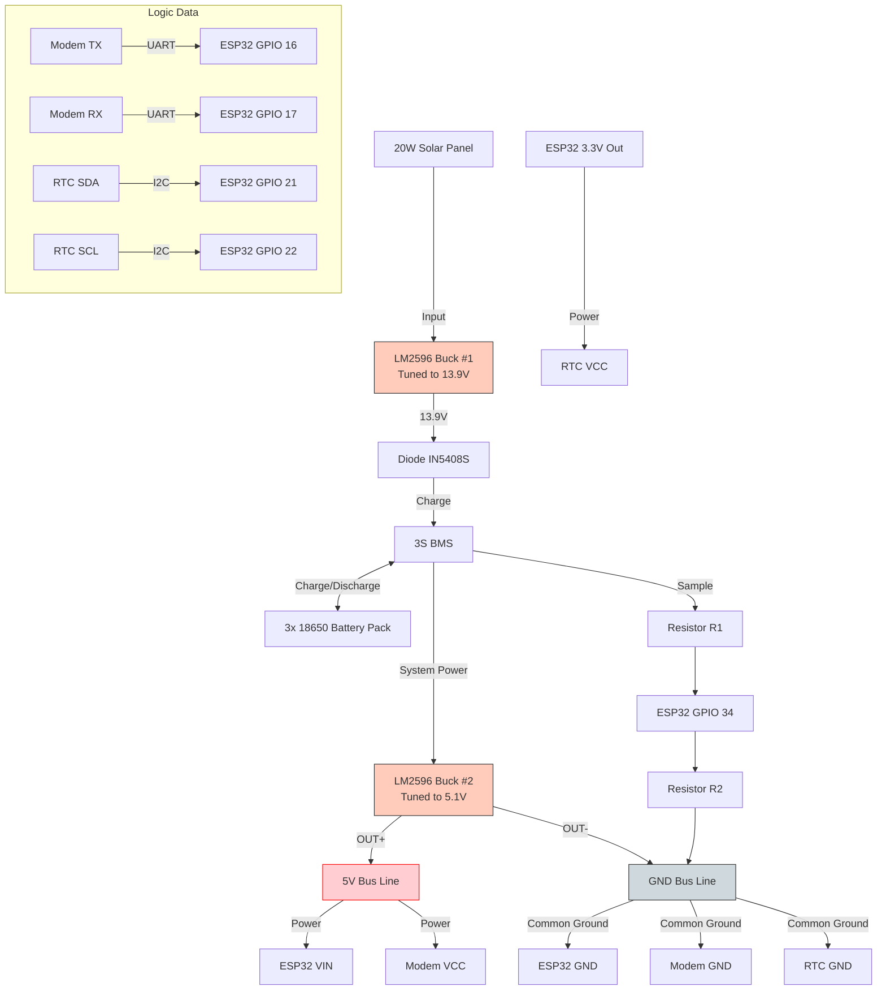

# 🧠 IoT Hub "Brain Board" Assembly Guide

**Objective:** Assemble the ESP32, 4G Modem, RTC, and Power Regulation onto a single 9x15cm Perfboard.
**Design Topology:** Star Power Distribution (Parallel Logic).

---

## 1. Component Layout Strategy

Divide the Perfboard into two distinct "Districts" to minimize noise and ensure clean power.

### ⚡ The Power District (Top 1/3 of Board)
- **Screw Terminal:** Place on the far LEFT edge (Easy battery access).
- **LM2596 Module:** Place next to the terminal.

### 💻 The Logic District (Bottom 2/3 of Board)
- **ESP32:** Bottom LEFT. *Crucial:* Face USB port OUTWARD.
- **4G Modem:** Bottom RIGHT. *Crucial:* Face Antenna connector OUTWARD.
- **RTC Module:** Center/Middle (Between ESP32 and Modem).

---

## 2. Soldering Steps

### Phase 1: The Skeleton (Headers)
*Do not solder modules directly. Use Female Headers.*

1. **Cut Headers:** Measure and cut female header strips to match pin counts.
2. **Mount:** Insert headers into the Perfboard.
   - **Tip:** Plug the ESP32/Modem into the headers before soldering to keep them perfectly straight.
3. **Solder:** Fix the headers to the board. Remove the modules once cool.

### Phase 2: The Power Tracks (The "Star")
*Objective: Deliver 5.1V to ESP32 and Modem independently.*

1. **Mount LM2596:** Solder the module (or input wires) near the top.
2. **Input Traces (High Current):**
   - Screw Terminal (+) -> LM2596 IN+
   - Screw Terminal (-) -> LM2596 IN-
3. **Output Bus (The "Main Line"):**
   - Create a thick solder trace or use thicker wire for LM2596 OUT+ (5.1V Bus).
   - Create a thick solder trace for LM2596 OUT- (GND Bus).
4. **Distribution:**
   - 5V Bus -> ESP32 Header (VIN / 5V pin).
   - 5V Bus -> Modem Header (VCC pin).
   - GND Bus -> ESP32 Header (GND).
   - GND Bus -> Modem Header (GND).
   - *Note: Do not power RTC from here. It uses 3.3V.*

### Phase 3: The Data Lines (Logic)
*Use thinner solid-core wire (e.g., ethernet strand).*

| From (Device) | To (ESP32 Pin) | Signal Type |
|---------------|----------------|-------------|
| Modem TX      | GPIO 16        | UART (RX2)  |
| Modem RX      | GPIO 17        | UART (TX2)  |
| RTC SDA       | GPIO 21        | I2C Data    |
| RTC SCL       | GPIO 22        | I2C Clock   |
| RTC VCC       | 3.3V Pin       | Power (Low V)|
| RTC GND       | GND Pin        | Common Ground|
| **Bat Divider** | **GPIO 34**   | **Analog In** |

---

## 3. Wiring Schematic (Visual Reference)

---

## 4. Final "Pre-Flight" Safety Check

### Before plugging in the ESP32/Modem modules:
1. **Visual Inspection:** Check underneath for solder blobs bridging two pins (short circuits).
2. **Voltage Verification:**
   - Connect Battery to Screw Terminals.
   - Set Multimeter to DC Volts.
   - Measure across the ESP32 Female Headers (VIN to GND). **Must be 5.1V.**
   - Measure across the Modem Female Headers (VCC to GND). **Must be 5.1V.**
   - *If > 5.2V:* Adjust LM2596 screw.
   - *If > 12V:* **STOP.** Check Buck Converter wiring.

### Module Installation:
1. Disconnect Battery.
2. Plug ESP32, Modem, and RTC into their headers.
3. **Double Check Orientation:** Ensure USB port and Antenna face the correct edges.